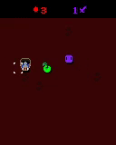

## Friend Limit
#### Ludum Dare 46 compo game

To build, make sure you also clone the submodules (SFML and glm)

Use
```
git clone --recurse-submodules git@github.com:Wesxdz/friend-limit.git
```
or after a standard clone, run these at the root directory
```
git submodule init
git submodule update
```

To build and play, go to root directory and then run
```
mkdir build
cd build
cmake ..
make -j16
./friendlimit
```

